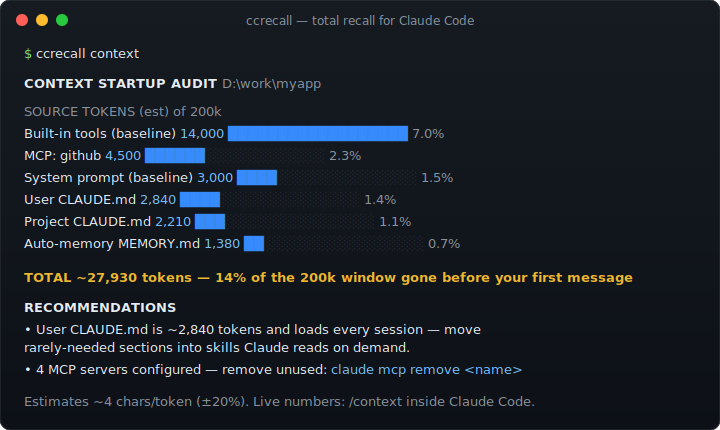

<div align="center">

# ccdistill

**Turn the corrections you keep repeating into permanent CLAUDE.md rules.**

Claude Code logs every session to `~/.claude/*.jsonl` — every correction, every command, every fix — then never reads them back.
`ccdistill` mines that history: it surfaces the rules you keep re-teaching as ready-to-paste CLAUDE.md, audits the context tax you pay before typing a word, and makes everything Claude ever did searchable.

[](https://github.com/ingridtoulotte/ccdistill/actions/workflows/ci.yml)
[](LICENSE)


**Zero dependencies · 100% local · nothing ever leaves your machine**



</div>

---

## The problem

Claude Code writes everything to `~/.claude/projects/*.jsonl` — every correction you gave, every command it ran, every bug it fixed. Then it never reads any of it again.

So you:

- **teach Claude the same thing twice** — "use pnpm, not npm" for the fifth time this month
- **lose answers you already paid for** — "we debugged this exact race condition in March… in which session?"
- **start every session with an invisible tax** — MCP tool schemas, CLAUDE.md files and memory indexes can eat 20%+ of your 200k window before `hello`

Your transcripts are a goldmine you never reopen. `ccdistill` is the pickaxe.

## Install

```bash
npm install -g github:ingridtoulotte/ccdistill    # or run once: npx github:ingridtoulotte/ccdistill
```

No config. No API key. No telemetry. It reads `~/.claude` and prints answers.

## The 60-second tour

### `ccdistill distill` — stop teaching Claude the same thing twice

Mines every session for the corrections you keep repeating and drafts them as CLAUDE.md rules:

```text
DISTILL — recurring corrections you keep giving Claude

 5×  use pnpm, not npm                                preference  2026-06-09
 3×  always run the tests before committing           rule        2026-06-08
 2×  don't add comments unless I ask                  prohibition 2026-06-02

Suggested CLAUDE.md block (review before adopting):
- use pnpm, not npm
- always run the tests before committing
- don't add comments unless I ask
```

Then let Claude itself polish them — no API key handling, it just pipes:

```bash
ccdistill distill --prompt | claude -p
```

### `ccdistill context` — find your context startup tax

Static audit of everything injected before your first message. No session needed, works in CI:

```text
CONTEXT STARTUP AUDIT  D:\work\myapp

SOURCE                     TOKENS (est)                      of 200k
MCP: github                       4,500  ██████████░░░░░░░░     2.3%
Built-in tools (baseline)        14,000  ██████████████████     7.0%
User CLAUDE.md                    2,840  ████░░░░░░░░░░░░░░     1.4%
Project CLAUDE.md                 2,210  ███░░░░░░░░░░░░░░░     1.1%
Auto-memory MEMORY.md             1,380  ██░░░░░░░░░░░░░░░░     0.7%

TOTAL ~24,930 tokens — 12% of the 200k window gone before your first message

RECOMMENDATIONS
  • User CLAUDE.md is ~2840 tokens and loads every session — move rarely-needed
    sections into skills or docs Claude reads on demand.
  • 4 MCP servers configured — each injects its full tool schemas. Remove unused
    ones: `claude mcp remove <name>`
```

### `ccdistill search` — everything Claude ever did, greppable

Full-text search across every project, every session, including the commands inside tool calls:

```bash
ccdistill search "race condition" --since 30d
ccdistill search "DROP TABLE" --role assistant     # what did it run, exactly?
ccdistill search "migrate.*postgres" --regex --project myapp
```

### `ccdistill stats` — your whole history, quantified

```text
115 sessions · 9 projects · 2026-03-02 → 2026-06-11
2,341 user msgs · 11,930 assistant msgs · 9,202 tool calls

TOP TOOLS                MODELS                              est cost
Bash    5,121 ██████████ opus    in 191k  out 1.7M  cache …  $442.06
Edit    2,265 ████░░░░░░ sonnet  in 91    out 18k   cache …    $3.54
…
Estimated total: $445.96
```

### `ccdistill sessions` / `ccdistill show` — browse and replay

```bash
ccdistill sessions --since 7d        # recent sessions: duration, msgs, cost, summary
ccdistill show ffccb46c              # pretty-print one transcript
```

## How it compares

| | `ccdistill` | `/context` (built-in) | ccusage | history viewers |
|---|---|---|---|---|
| Distill history → CLAUDE.md rules | ✅ | ❌ | ❌ | ❌ |
| Context audit without burning a session | ✅ | ❌ (live only) | ❌ | ❌ |
| Context guard in CI | ✅ `--json` | ❌ | ❌ | ❌ |
| Cross-project full-text search | ✅ | ❌ | ❌ | ✅ (some) |
| Cost & usage analytics | ✅ | ❌ | ✅ | partial |
| Dependencies | **0** | — | many | many |

The viewers show you your history. `ccdistill` **acts** on it: rules out of repetition, guardrails out of audits.

## Performance

Streaming JSONL parser, raw-line prefilter before any JSON.parse:

```text
scan:   29.2 MB, 100,000 lines in 170 ms   (≈588,000 lines/s)
search: 100,000 lines in 48 ms             (≈2,000,000 lines/s)
```

Reproduce: `npm run bench`.

## JSON mode & CI guard

Every command takes `--json`. Fail a PR when context startup cost crosses a budget:

```yaml
- run: npm install -g github:ingridtoulotte/ccdistill
- run: |
    TOTAL=$(ccdistill context --json | jq .total)
    if [ "$TOTAL" -gt 30000 ]; then
      echo "Context startup tax is $TOTAL tokens (budget: 30000)"; exit 1
    fi
```

Full example: [`examples/ci-context-guard.yml`](examples/ci-context-guard.yml).

## Privacy

`ccdistill` is read-only over your local `~/.claude` directory. It makes **zero network calls** — no telemetry, no update checks, no API requests. The `--prompt` flow only prints text; *you* choose to pipe it into `claude`.

## Programmatic API

```js
const { scanAll, searchTranscripts, distill, auditContext } = require('ccdistill');
const sessions = await scanAll(claudeDir);
```

## Docs

- [Getting started](docs/getting-started.md)
- [Command reference](docs/commands.md)
- [Architecture](docs/architecture.md)
- [FAQ](docs/faq.md)
- [Roadmap](ROADMAP.md)

## Contributing

PRs welcome — the codebase is small, dependency-free Node and stays that way. See [CONTRIBUTING.md](CONTRIBUTING.md).

## License

[MIT](LICENSE)

---

<div align="center">

**If ccdistill saved you a "wait, I already explained this to Claude" moment — star the repo so others find it.** ⭐

</div>
