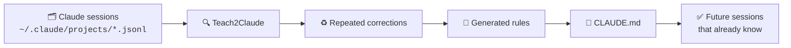
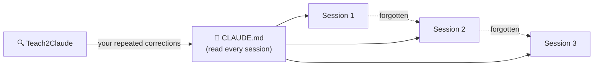
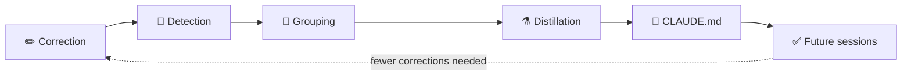

<div align="center">

# Teach2Claude

### Stop teaching Claude the same thing over and over.

**Turn repeated corrections into permanent CLAUDE.md memory.**

You've told Claude Code *"use pnpm, not npm"* five times this month.
It's already written down in your session logs — Claude just never reads them back.
Teach2Claude does.

✓ Learns from your history &nbsp;·&nbsp; ✓ Generates persistent rules &nbsp;·&nbsp; ✓ 100% local
✓ No API key &nbsp;·&nbsp; ✓ No cloud &nbsp;·&nbsp; ✓ Zero dependencies

[](https://github.com/ingridtoulotte/Teach2Claude/actions/workflows/ci.yml)
[](LICENSE)


</div>



<div align="center">


*`teach2claude distill` — your most-repeated corrections, counted, dated, and drafted as a ready-to-paste CLAUDE.md block.*

</div>

<!-- Screenshots: drop PNGs into docs/screenshots/ and uncomment.
<p align="center">
  <br>
  <em>distill — recurring corrections ranked by repetition count</em>
</p>
<p align="center">
  <br>
  <em>context — what eats your window before you type a word</em>
</p>
<p align="center">
  <br>
  <em>search — full-text search across every session, every project</em>
</p>
-->

---

## The hidden cost of forgetting

Claude Code logs every session — every correction, every preference, every *"no, do it this way."*
Then it starts the next session knowing none of it.

Here's what one typical week of that looks like *(illustrative example — run `distill` to see yours)*:

| Correction you typed | Times repeated |
| -------------------- | -------------: |
| Use pnpm, not npm | 5 |
| Run the tests before committing | 3 |
| Don't add comments I didn't ask for | 2 |

```text
Repeated instructions typed:  10
Rules they boil down to:       3
Repetitions needed after
adding them to CLAUDE.md:      0
```

The rules you most need in CLAUDE.md are exactly the ones you're too busy repeating to write down.
**If you've corrected Claude twice for the same thing, that rule already exists in your history. Teach2Claude finds it.**

## Before → After

```text
BEFORE — you, every single session
┌──────────────────────────────────────────┐
│ Session 1   ❯ use pnpm, not npm          │
│ Session 2   ❯ use pnpm, not npm          │
│ Session 3   ❯ use pnpm, not npm          │
│ Session 4   ❯ use pnpm, not npm          │
│ Session 5   ❯ use pnpm, not npm          │
└──────────────────────────────────────────┘

AFTER — teach2claude, run once
┌──────────────────────────────────────────┐
│ ♻️  Recurring preference detected (5×)    │
│                                          │
│ Rule  →  CLAUDE.md:                      │
│   - use pnpm, not npm                    │
│                                          │
│ Future repetitions:  0                   │
└──────────────────────────────────────────┘
```

Real output:

```bash
$ teach2claude distill

DISTILL — recurring corrections you keep giving Claude

 5×  use pnpm, not npm                                preference  2026-06-09
 3×  always run the tests before committing           rule        2026-06-08
 2×  don't add comments unless I ask                  prohibition 2026-06-02

Suggested CLAUDE.md block (review before adopting):
- use pnpm, not npm
- always run the tests before committing
- don't add comments unless I ask
```

Paste the block into CLAUDE.md. Done. Those corrections never need typing again.

## Why CLAUDE.md exists

- Claude **forgets** everything between sessions.
- Claude **reads CLAUDE.md** at the start of every session.
- Teach2Claude **bridges the gap**: it moves what you keep saying into the one file Claude actually reads.



## How it works



1. **Scan** — streams every session transcript on your machine (`~/.claude/projects/*.jsonl`).
2. **Detect** — pattern-matches user messages that are corrections, prohibitions, or preferences (English and French).
3. **Group** — normalizes and dedupes, so *"use pnpm not npm"* and *"pnpm, not npm!"* count as one rule said twice.
4. **Distill** — anything repeated enough becomes a drafted rule, ranked by repetition count and recency.
5. **Reuse** — paste the block into CLAUDE.md. Optionally pipe through Claude itself for polish: `teach2claude distill --prompt | claude -p` (no API key — it's your existing `claude` CLI).

## What it usually finds

*Illustrative distribution — varies by user. Run `distill` to see yours.*

```text
Preferences        ████████████░░░░░░░░░░░░░░░░░░  ~40%   "use pnpm, not npm"
Workflow rules     ██████████░░░░░░░░░░░░░░░░░░░░  ~35%   "run tests before committing"
Coding style       █████░░░░░░░░░░░░░░░░░░░░░░░░░  ~15%   "no comments unless asked"
Other              ███░░░░░░░░░░░░░░░░░░░░░░░░░░░  ~10%   project-specific habits
```

## At a glance

<div align="center">

| **100%** | **0** | **0** | **1** |
|:---:|:---:|:---:|:---:|
| Local | Dependencies | Network calls | Purpose |
| your data stays on disk | pure Node ≥18 stdlib | no telemetry, ever | teach Claude your rules |

</div>

## Why it's different

- **Prompt hacks** — *"always remember to…"* pasted at the top of every session. Decays the moment you forget to paste it.
- **Hand-written memory files** — you write the rules you *remember* needing, not the ones you actually repeat most.
- **AI wrapper apps** — your transcripts get uploaded somewhere, an API key gets involved, a subscription appears.

Teach2Claude is none of these. The rules come from **evidence** — what you actually said, counted and dated — and the output goes into the one file Claude already reads.

| | **Teach2Claude** | Prompt hacks | Manual CLAUDE.md | Wrapper apps |
|---|:---:|:---:|:---:|:---:|
| Finds rules automatically | ✅ | ❌ | ❌ | some |
| Evidence-based (counts real corrections) | ✅ | ❌ | ❌ | ❌ |
| Persists across sessions | ✅ | ❌ | ✅ | varies |
| Local-first — nothing leaves your machine | ✅ | ✅ | ✅ | ❌ |
| Repeatable — same history, same rules | ✅ | ❌ | ❌ | ❌ |
| Transparent — shows counts, dates, sources | ✅ | ❌ | ❌ | ❌ |
| No API key, no subscription | ✅ | ✅ | ✅ | ❌ |
| Dependencies | **0** | — | — | many |

## Who it's for

| You are… | Teach2Claude gives you… |
|---|---|
| **Solo developer** | your personal habits become standing rules — once |
| **Open-source maintainer** | project conventions enforced every session, not re-explained per PR |
| **Staff engineer** | team standards (test-first, commit style) distilled from how you actually review |
| **AI-heavy workflow** | dozens of sessions/week — repetition compounds fastest, so does the payoff |
| **Team on Claude Code daily** | a shared CLAUDE.md grown from evidence instead of meeting notes |

## Why trust it

- ✓ Reads **local logs only** (`~/.claude`) — read-only
- ✓ **No telemetry** — not even update checks
- ✓ **No uploads** — zero network calls, verifiable in the source
- ✓ **No cloud processing** — everything runs on your machine
- ✓ **Open source** — MIT, small dependency-free codebase you can read in one sitting
- ✓ **Reproducible** — same history in, same rules out; deterministic pattern matching, not a black box
- ✓ **Transparent** — every suggested rule shows its repetition count and last-seen date
- ✓ **You stay in control** — it *suggests* a CLAUDE.md block; you review and paste

## Quick start

```text
 ① Install  ──▶  ② Run  ──▶  ③ Review rules  ──▶  ④ Paste into CLAUDE.md  ──▶  ✅ Done
```

**① Install** (or skip straight to `npx`):

```bash
npm install -g github:ingridtoulotte/Teach2Claude
```

**② Run:**

```bash
teach2claude distill                          # see what you keep repeating
teach2claude distill --prompt | claude -p     # let Claude itself polish the rules
```

**③ Review** the suggested rules — each one shows how often you said it and when.

**④ Paste** the block into your `CLAUDE.md`.

Zero-install one-liner:

```bash
npx github:ingridtoulotte/Teach2Claude distill
```

No config. No API key. No telemetry. It reads `~/.claude` and prints answers.

## What happens after install

```text
Day 1   ─────────●  Run distill. Your most-repeated corrections surface,
                    counted and dated. Paste the first rules into CLAUDE.md.

Day 7   ─────────●  New repetitions show up as you work. CLAUDE.md grows
                    from evidence, not guesswork.

Day 30  ─────────●  Claude behaves consistently across sessions and
                    projects. Mid-session corrections became one line
                    Claude reads at startup.
```

## Also in the box

```bash
teach2claude context                    # audit tokens injected before your first message
teach2claude search "race condition"    # full-text search across every session, every project
teach2claude stats                      # usage, top tools, estimated cost across your history
teach2claude sessions --since 7d        # browse recent sessions; `show <id>` replays one
```

Every command takes `--json` — including a [CI guard](examples/ci-context-guard.yml) that fails a PR when context startup cost crosses a budget.

`teach2claude context` deserves a special mention: it statically audits everything injected into your window before you type a word (MCP schemas, CLAUDE.md files, memory indexes) — these routinely eat 20%+ of a 200k window before `hello`.

## Performance

Streaming JSONL parser with a raw-line prefilter before any `JSON.parse`:

```text
scan:   29.2 MB, 100,000 lines in 170 ms   (≈588,000 lines/s)
search: 100,000 lines in 48 ms             (≈2,000,000 lines/s)
```

Reproduce: `npm run bench`.

## Privacy

Read-only over your local `~/.claude` directory. **Zero network calls** — no telemetry, no update checks, no API requests. The `--prompt` flow only prints text; *you* choose to pipe it into `claude`.

## Docs

[Getting started](docs/getting-started.md) · [Command reference](docs/commands.md) · [Architecture](docs/architecture.md) · [FAQ](docs/faq.md) · [Roadmap](ROADMAP.md)

## Contributing

PRs welcome — the codebase is small, dependency-free Node and stays that way. See [CONTRIBUTING.md](CONTRIBUTING.md).

## License

[MIT](LICENSE)

---

<div align="center">

### If you've ever typed the same instruction twice, Teach2Claude already has something to teach you.

```bash
npx github:ingridtoulotte/Teach2Claude distill
```

**Saved you one "wait, I already told Claude this" moment? Star the repo so others find it.** ⭐

</div>
